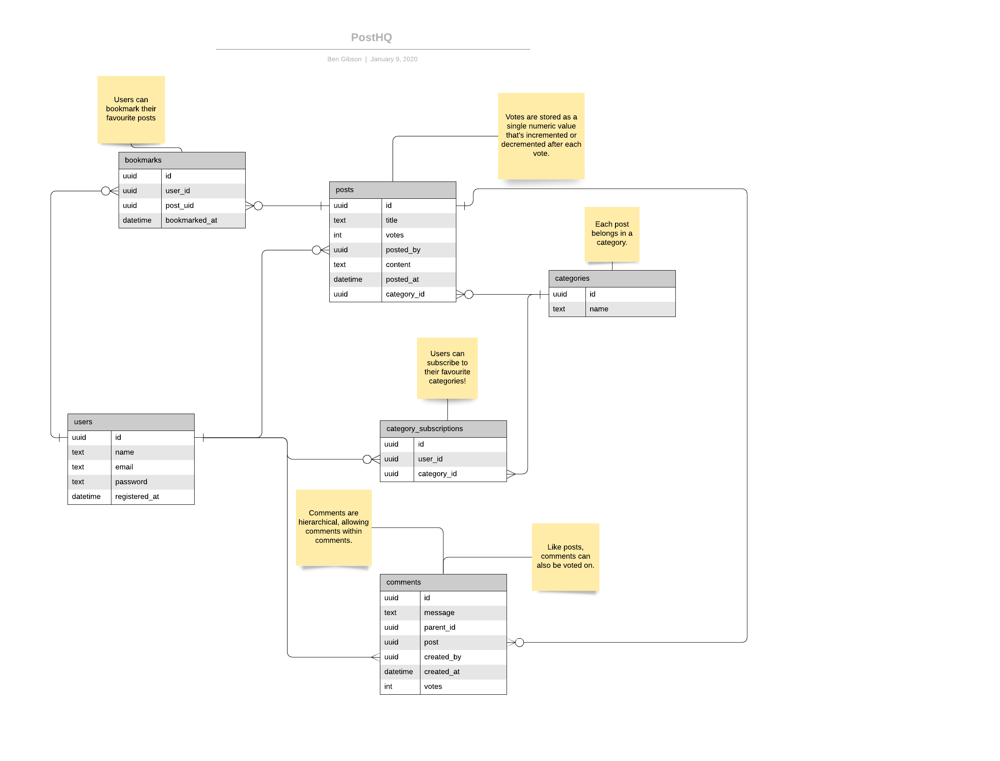

Technical Design
===

TODO: Change how votes are recorded against a Post so they can be traced back to the User.

## Endpoints

### Posts

* `GET /posts` - Get all posts. By default this will be ordered by votes.
* `GET /posts/{id}` - Get a post by its id.
* `DELETE /posts/{id}` - Delete a post by its id.
* `POST /posts` - Create a new post.
* `PUT /posts/{id}/vote` - Cast a user's vote. A user can only cast one vote per post, additional calls should override 
their original vote.

### Categories

* `GET /categories` - Get all categories.
* `GET /categories/{id}` - Get a category by its id.
* `DELETE /categories/{id}` - Delete a category by its id.
* `POST /categories` - Create a new category.

* `GET /categories/{id}/subscriptions` - Get all subscriptions to the specific category.

### Users

* `GET /users` - Get all users.
* `GET /users/{id}` - Get a user by their id.
* `DELETE /users/{id}` - Delete a user by their id.
* `POST /users` - Register a new user.

* `GET /users/{id}/subscriptions` - Get all subscriptions by a specific user.
* `GET /user/subscriptions` - Get all subscriptions by the authenticated user.
* `PUT /user/categories/{id}/subscriptions` - Subscribe the authenticated user to a category.
* `DELETE /user/categories/{id}/subscriptions` - Unsubscribe the authenticated user from a category.

### Bookmarks

### Comments 
